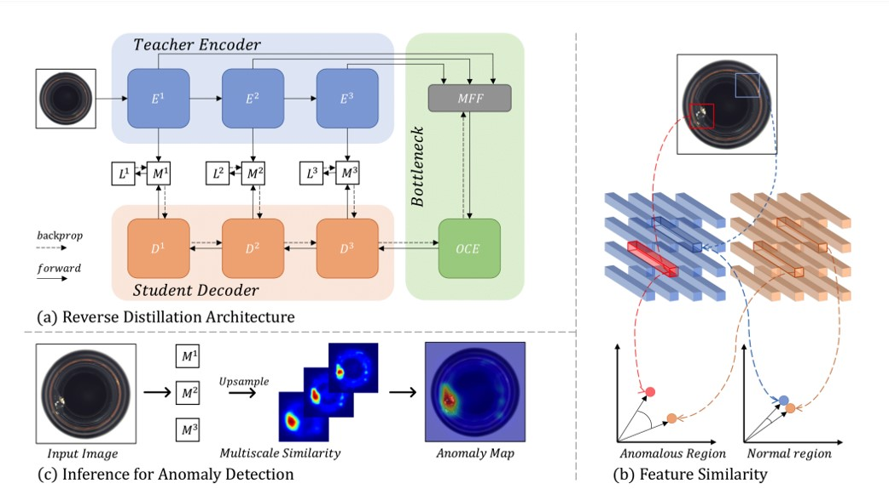

# ML課程實作 - Anomaly-Detection-via-Reverse-Distillation-from-One-Class-Embedding

This repository contains code for training and evaluating the proposed method in our paper [Anomaly Detection via Reverse Distillation from One-Class Embedding]([https://arxiv.org/pdf/2011.11108.pdf](https://openaccess.thecvf.com/content/CVPR2022/papers/Deng_Anomaly_Detection_via_Reverse_Distillation_From_One-Class_Embedding_CVPR_2022_paper.pdf)).



## Environment
	> pytorch == 1.91
	
	> torchvision == 0.10.1
	
	> numpy == 1.20.3
	
	> scipy == 1.7.1
	
	> sklearn == 1.0
	
	> PIL == 8.3.2

### Citation
If you find this useful for your research, please cite the following paper:
``` bash
@InProceedings{Deng_2022_CVPR,
    author    = {Deng, Hanqiu and Li, Xingyu},
    title     = {Anomaly Detection via Reverse Distillation From One-Class Embedding},
    booktitle = {Proceedings of the IEEE/CVF Conference on Computer Vision and Pattern Recognition (CVPR)},
    month     = {June},
    year      = {2022},
    pages     = {9737-9746}
}
```

#### 1- Clone this repo:
``` bash
git clone https://github.com/weichang888/Anomaly-Detection-via-Reverse-Distillation-from-One-Class-Embedding.git
```
#### 2- Datsets:
This repository performs Novelty/Anomaly Detection in the following datasets: MNIST, Fashion-MNIST, CIFAR-10, MVTecAD.

Furthermore, Anomaly Localization have been performed on MVTecAD dataset.

MNIST, Fashion-MNIST and CIFAR-10 datasets will be downloaded by Torchvision. You have to download [MVTecAD](https://www.mvtec.com/company/research/datasets/mvtec-ad/)

#### 3- Train and Test the Model:
Start the training (and evaluation) by running the following command. The training script in `main.py` iterates through all defined classes in the MVTec dataset, performs training and evaluation, and saves the checkpoints in the ./checkpoints/ folder.
``` bash
python main.py
```
